```mermaid
flowchart TB
    subgraph current["docs.shproj"]
        MAIN["<b>📦&nbsp;docs.shproj</b><br/><small>net10.0</small>"]
        click MAIN "#docsdocsshproj"
    end

```

```mermaid
flowchart TB
    subgraph current["Hyperbee.MigrationRunner.MongoDB.csproj"]
        MAIN["<b>📦&nbsp;Hyperbee.MigrationRunner.MongoDB.csproj</b><br/><small>net10.0</small>"]
        click MAIN "#sampleshyperbeemigrationrunnermongodbhyperbeemigrationrunnermongodbcsproj"
    end
    subgraph downstream["Dependencies (2"]
        P8["<b>📦&nbsp;Hyperbee.Migrations.Providers.MongoDB.csproj</b><br/><small>net10.0</small>"]
        P2["<b>📦&nbsp;Hyperbee.Migrations.csproj</b><br/><small>net10.0</small>"]
        click P8 "#srchyperbeemigrationsprovidersmongodbhyperbeemigrationsprovidersmongodbcsproj"
        click P2 "#srchyperbeemigrationshyperbeemigrationscsproj"
    end
    MAIN --> P8
    MAIN --> P2

```

```mermaid
flowchart TB
    subgraph upstream["Dependants (3)"]
        P1["<b>📦&nbsp;Hyperbee.Migrations.Tests.csproj</b><br/><small>net10.0</small>"]
        P4["<b>📦&nbsp;Hyperbee.Migrations.Couchbase.Samples.csproj</b><br/><small>net10.0</small>"]
        P11["<b>📦&nbsp;Hyperbee.MigrationRunner.Couchbase.csproj</b><br/><small>net10.0</small>"]
        click P1 "#testshyperbeemigrationstestshyperbeemigrationstestscsproj"
        click P4 "#sampleshyperbeemigrationscouchbasesampleshyperbeemigrationscouchbasesamplescsproj"
        click P11 "#sampleshyperbeemigrationrunnercouchbasehyperbeemigrationrunnercouchbasecsproj"
    end
    subgraph current["Hyperbee.Migrations.Providers.Couchbase.csproj"]
        MAIN["<b>📦&nbsp;Hyperbee.Migrations.Providers.Couchbase.csproj</b><br/><small>net10.0</small>"]
        click MAIN "#srchyperbeemigrationsproviderscouchbasehyperbeemigrationsproviderscouchbasecsproj"
    end
    subgraph downstream["Dependencies (1"]
        P2["<b>📦&nbsp;Hyperbee.Migrations.csproj</b><br/><small>net10.0</small>"]
        click P2 "#srchyperbeemigrationshyperbeemigrationscsproj"
    end
    P1 --> MAIN
    P4 --> MAIN
    P11 --> MAIN
    MAIN --> P2

```

```mermaid
flowchart TB
    subgraph upstream["Dependants (2)"]
        P9["<b>📦&nbsp;Hyperbee.Migrations.MongoDB.Samples.csproj</b><br/><small>net10.0</small>"]
        P12["<b>📦&nbsp;Hyperbee.MigrationRunner.MongoDB.csproj</b><br/><small>net10.0</small>"]
        click P9 "#sampleshyperbeemigrationsmongodbsampleshyperbeemigrationsmongodbsamplescsproj"
        click P12 "#sampleshyperbeemigrationrunnermongodbhyperbeemigrationrunnermongodbcsproj"
    end
    subgraph current["Hyperbee.Migrations.Providers.MongoDB.csproj"]
        MAIN["<b>📦&nbsp;Hyperbee.Migrations.Providers.MongoDB.csproj</b><br/><small>net10.0</small>"]
        click MAIN "#srchyperbeemigrationsprovidersmongodbhyperbeemigrationsprovidersmongodbcsproj"
    end
    subgraph downstream["Dependencies (1"]
        P2["<b>📦&nbsp;Hyperbee.Migrations.csproj</b><br/><small>net10.0</small>"]
        click P2 "#srchyperbeemigrationshyperbeemigrationscsproj"
    end
    P9 --> MAIN
    P12 --> MAIN
    MAIN --> P2

```

```mermaid
flowchart TB
    subgraph upstream["Dependants (2)"]
        P5["<b>📦&nbsp;Hyperbee.Migrations.Postgres.Samples.csproj</b><br/><small>net10.0</small>"]
        P10["<b>📦&nbsp;Hyperbee.MigrationRunner.Postgres.csproj</b><br/><small>net10.0</small>"]
        click P5 "#sampleshyperbeemigrationspostgressampleshyperbeemigrationspostgressamplescsproj"
        click P10 "#sampleshyperbeemigrationrunnerpostgreshyperbeemigrationrunnerpostgrescsproj"
    end
    subgraph current["Hyperbee.Migrations.Providers.Postgres.csproj"]
        MAIN["<b>📦&nbsp;Hyperbee.Migrations.Providers.Postgres.csproj</b><br/><small>net10.0</small>"]
        click MAIN "#srchyperbeemigrationsproviderspostgreshyperbeemigrationsproviderspostgrescsproj"
    end
    subgraph downstream["Dependencies (1"]
        P2["<b>📦&nbsp;Hyperbee.Migrations.csproj</b><br/><small>net10.0</small>"]
        click P2 "#srchyperbeemigrationshyperbeemigrationscsproj"
    end
    P5 --> MAIN
    P10 --> MAIN
    MAIN --> P2

```

```mermaid
flowchart TB
    subgraph upstream["Dependants (10)"]
        P1["<b>📦&nbsp;Hyperbee.Migrations.Tests.csproj</b><br/><small>net10.0</small>"]
        P3["<b>📦&nbsp;Hyperbee.Migrations.Providers.Couchbase.csproj</b><br/><small>net10.0</small>"]
        P4["<b>📦&nbsp;Hyperbee.Migrations.Couchbase.Samples.csproj</b><br/><small>net10.0</small>"]
        P5["<b>📦&nbsp;Hyperbee.Migrations.Postgres.Samples.csproj</b><br/><small>net10.0</small>"]
        P6["<b>📦&nbsp;Hyperbee.Migrations.Providers.Postgres.csproj</b><br/><small>net10.0</small>"]
        P8["<b>📦&nbsp;Hyperbee.Migrations.Providers.MongoDB.csproj</b><br/><small>net10.0</small>"]
        P9["<b>📦&nbsp;Hyperbee.Migrations.MongoDB.Samples.csproj</b><br/><small>net10.0</small>"]
        P10["<b>📦&nbsp;Hyperbee.MigrationRunner.Postgres.csproj</b><br/><small>net10.0</small>"]
        P11["<b>📦&nbsp;Hyperbee.MigrationRunner.Couchbase.csproj</b><br/><small>net10.0</small>"]
        P12["<b>📦&nbsp;Hyperbee.MigrationRunner.MongoDB.csproj</b><br/><small>net10.0</small>"]
        click P1 "#testshyperbeemigrationstestshyperbeemigrationstestscsproj"
        click P3 "#srchyperbeemigrationsproviderscouchbasehyperbeemigrationsproviderscouchbasecsproj"
        click P4 "#sampleshyperbeemigrationscouchbasesampleshyperbeemigrationscouchbasesamplescsproj"
        click P5 "#sampleshyperbeemigrationspostgressampleshyperbeemigrationspostgressamplescsproj"
        click P6 "#srchyperbeemigrationsproviderspostgreshyperbeemigrationsproviderspostgrescsproj"
        click P8 "#srchyperbeemigrationsprovidersmongodbhyperbeemigrationsprovidersmongodbcsproj"
        click P9 "#sampleshyperbeemigrationsmongodbsampleshyperbeemigrationsmongodbsamplescsproj"
        click P10 "#sampleshyperbeemigrationrunnerpostgreshyperbeemigrationrunnerpostgrescsproj"
        click P11 "#sampleshyperbeemigrationrunnercouchbasehyperbeemigrationrunnercouchbasecsproj"
        click P12 "#sampleshyperbeemigrationrunnermongodbhyperbeemigrationrunnermongodbcsproj"
    end
    subgraph current["Hyperbee.Migrations.csproj"]
        MAIN["<b>📦&nbsp;Hyperbee.Migrations.csproj</b><br/><small>net10.0</small>"]
        click MAIN "#srchyperbeemigrationshyperbeemigrationscsproj"
    end
    P1 --> MAIN
    P3 --> MAIN
    P4 --> MAIN
    P5 --> MAIN
    P6 --> MAIN
    P8 --> MAIN
    P9 --> MAIN
    P10 --> MAIN
    P11 --> MAIN
    P12 --> MAIN

```

```mermaid
flowchart TB
    subgraph current["Hyperbee.Migrations.Integration.Tests.csproj"]
        MAIN["<b>📦&nbsp;Hyperbee.Migrations.Integration.Tests.csproj</b><br/><small>net10.0</small>"]
        click MAIN "#testshyperbeemigrationsintegrationtestshyperbeemigrationsintegrationtestscsproj"
    end

```

```mermaid
flowchart TB
    subgraph current["Hyperbee.Migrations.Tests.csproj"]
        MAIN["<b>📦&nbsp;Hyperbee.Migrations.Tests.csproj</b><br/><small>net10.0</small>"]
        click MAIN "#testshyperbeemigrationstestshyperbeemigrationstestscsproj"
    end
    subgraph downstream["Dependencies (2"]
        P3["<b>📦&nbsp;Hyperbee.Migrations.Providers.Couchbase.csproj</b><br/><small>net10.0</small>"]
        P2["<b>📦&nbsp;Hyperbee.Migrations.csproj</b><br/><small>net10.0</small>"]
        click P3 "#srchyperbeemigrationsproviderscouchbasehyperbeemigrationsproviderscouchbasecsproj"
        click P2 "#srchyperbeemigrationshyperbeemigrationscsproj"
    end
    MAIN --> P3
    MAIN --> P2

```

# Projects and dependencies analysis

This document provides a comprehensive overview of the projects and their dependencies in the context of upgrading to .NETCoreApp,Version=v10.0.

## Table of Contents

- [Executive Summary](#executive-Summary)
  - [Highlevel Metrics](#highlevel-metrics)
  - [Projects Compatibility](#projects-compatibility)
  - [Package Compatibility](#package-compatibility)
  - [API Compatibility](#api-compatibility)
- [Aggregate NuGet packages details](#aggregate-nuget-packages-details)
- [Top API Migration Challenges](#top-api-migration-challenges)
  - [Technologies and Features](#technologies-and-features)
  - [Most Frequent API Issues](#most-frequent-api-issues)
- [Projects Relationship Graph](#projects-relationship-graph)
- [Project Details](#project-details)

  - [docs\docs.shproj](#docsdocsshproj)
  - [samples\Hyperbee.MigrationRunner.Couchbase\Hyperbee.MigrationRunner.Couchbase.csproj](#sampleshyperbeemigrationrunnercouchbasehyperbeemigrationrunnercouchbasecsproj)
  - [samples\Hyperbee.MigrationRunner.MongoDB\Hyperbee.MigrationRunner.MongoDB.csproj](#sampleshyperbeemigrationrunnermongodbhyperbeemigrationrunnermongodbcsproj)
  - [samples\Hyperbee.MigrationRunner.Postgres\Hyperbee.MigrationRunner.Postgres.csproj](#sampleshyperbeemigrationrunnerpostgreshyperbeemigrationrunnerpostgrescsproj)
  - [samples\Hyperbee.Migrations.Couchbase.Samples\Hyperbee.Migrations.Couchbase.Samples.csproj](#sampleshyperbeemigrationscouchbasesampleshyperbeemigrationscouchbasesamplescsproj)
  - [samples\Hyperbee.Migrations.MongoDB.Samples\Hyperbee.Migrations.MongoDB.Samples.csproj](#sampleshyperbeemigrationsmongodbsampleshyperbeemigrationsmongodbsamplescsproj)
  - [samples\Hyperbee.Migrations.Postgres.Samples\Hyperbee.Migrations.Postgres.Samples.csproj](#sampleshyperbeemigrationspostgressampleshyperbeemigrationspostgressamplescsproj)
  - [src\Hyperbee.Migrations.Providers.Couchbase\Hyperbee.Migrations.Providers.Couchbase.csproj](#srchyperbeemigrationsproviderscouchbasehyperbeemigrationsproviderscouchbasecsproj)
  - [src\Hyperbee.Migrations.Providers.MongoDB\Hyperbee.Migrations.Providers.MongoDB.csproj](#srchyperbeemigrationsprovidersmongodbhyperbeemigrationsprovidersmongodbcsproj)
  - [src\Hyperbee.Migrations.Providers.Postgres\Hyperbee.Migrations.Providers.Postgres.csproj](#srchyperbeemigrationsproviderspostgreshyperbeemigrationsproviderspostgrescsproj)
  - [src\Hyperbee.Migrations\Hyperbee.Migrations.csproj](#srchyperbeemigrationshyperbeemigrationscsproj)
  - [tests\Hyperbee.Migrations.Integration.Tests\Hyperbee.Migrations.Integration.Tests.csproj](#testshyperbeemigrationsintegrationtestshyperbeemigrationsintegrationtestscsproj)
  - [tests\Hyperbee.Migrations.Tests\Hyperbee.Migrations.Tests.csproj](#testshyperbeemigrationstestshyperbeemigrationstestscsproj)

## Executive Summary

### Highlevel Metrics

| Metric | Count | Status |
| :--- | :---: | :--- |
| Total Projects | 13 | 0 require upgrade |
| Total NuGet Packages | 40 | All compatible |
| Total Code Files | 83 |  |
| Total Code Files with Incidents | 0 |  |
| Total Lines of Code | 6623 |  |
| Total Number of Issues | 0 |  |
| Estimated LOC to modify | 0+ | at least 0.0% of codebase |

### Projects Compatibility

| Project | Target Framework | Difficulty | Package Issues | API Issues | Est. LOC Impact | Description |
| :--- | :---: | :---: | :---: | :---: | :---: | :--- |
| [docs\docs.shproj](#docsdocsshproj) | net10.0 | ✅ None | 0 | 0 |  | DotNetCoreApp, Sdk Style = True |
| [samples\Hyperbee.MigrationRunner.Couchbase\Hyperbee.MigrationRunner.Couchbase.csproj](#sampleshyperbeemigrationrunnercouchbasehyperbeemigrationrunnercouchbasecsproj) | net10.0 | ✅ None | 0 | 0 |  | DotNetCoreApp, Sdk Style = True |
| [samples\Hyperbee.MigrationRunner.MongoDB\Hyperbee.MigrationRunner.MongoDB.csproj](#sampleshyperbeemigrationrunnermongodbhyperbeemigrationrunnermongodbcsproj) | net10.0 | ✅ None | 0 | 0 |  | DotNetCoreApp, Sdk Style = True |
| [samples\Hyperbee.MigrationRunner.Postgres\Hyperbee.MigrationRunner.Postgres.csproj](#sampleshyperbeemigrationrunnerpostgreshyperbeemigrationrunnerpostgrescsproj) | net10.0 | ✅ None | 0 | 0 |  | DotNetCoreApp, Sdk Style = True |
| [samples\Hyperbee.Migrations.Couchbase.Samples\Hyperbee.Migrations.Couchbase.Samples.csproj](#sampleshyperbeemigrationscouchbasesampleshyperbeemigrationscouchbasesamplescsproj) | net10.0 | ✅ None | 0 | 0 |  | ClassLibrary, Sdk Style = True |
| [samples\Hyperbee.Migrations.MongoDB.Samples\Hyperbee.Migrations.MongoDB.Samples.csproj](#sampleshyperbeemigrationsmongodbsampleshyperbeemigrationsmongodbsamplescsproj) | net10.0 | ✅ None | 0 | 0 |  | ClassLibrary, Sdk Style = True |
| [samples\Hyperbee.Migrations.Postgres.Samples\Hyperbee.Migrations.Postgres.Samples.csproj](#sampleshyperbeemigrationspostgressampleshyperbeemigrationspostgressamplescsproj) | net10.0 | ✅ None | 0 | 0 |  | ClassLibrary, Sdk Style = True |
| [src\Hyperbee.Migrations.Providers.Couchbase\Hyperbee.Migrations.Providers.Couchbase.csproj](#srchyperbeemigrationsproviderscouchbasehyperbeemigrationsproviderscouchbasecsproj) | net10.0 | ✅ None | 0 | 0 |  | ClassLibrary, Sdk Style = True |
| [src\Hyperbee.Migrations.Providers.MongoDB\Hyperbee.Migrations.Providers.MongoDB.csproj](#srchyperbeemigrationsprovidersmongodbhyperbeemigrationsprovidersmongodbcsproj) | net10.0 | ✅ None | 0 | 0 |  | ClassLibrary, Sdk Style = True |
| [src\Hyperbee.Migrations.Providers.Postgres\Hyperbee.Migrations.Providers.Postgres.csproj](#srchyperbeemigrationsproviderspostgreshyperbeemigrationsproviderspostgrescsproj) | net10.0 | ✅ None | 0 | 0 |  | ClassLibrary, Sdk Style = True |
| [src\Hyperbee.Migrations\Hyperbee.Migrations.csproj](#srchyperbeemigrationshyperbeemigrationscsproj) | net10.0 | ✅ None | 0 | 0 |  | ClassLibrary, Sdk Style = True |
| [tests\Hyperbee.Migrations.Integration.Tests\Hyperbee.Migrations.Integration.Tests.csproj](#testshyperbeemigrationsintegrationtestshyperbeemigrationsintegrationtestscsproj) | net10.0 | ✅ None | 0 | 0 |  | DotNetCoreApp, Sdk Style = True |
| [tests\Hyperbee.Migrations.Tests\Hyperbee.Migrations.Tests.csproj](#testshyperbeemigrationstestshyperbeemigrationstestscsproj) | net10.0 | ✅ None | 0 | 0 |  | DotNetCoreApp, Sdk Style = True |

### Package Compatibility

| Status | Count | Percentage |
| :--- | :---: | :---: |
| ✅ Compatible | 40 | 100.0% |
| ⚠️ Incompatible | 0 | 0.0% |
| 🔄 Upgrade Recommended | 0 | 0.0% |
| ***Total NuGet Packages*** | ***40*** | ***100%*** |

### API Compatibility

| Category | Count | Impact |
| :--- | :---: | :--- |
| 🔴 Binary Incompatible | 0 | High - Require code changes |
| 🟡 Source Incompatible | 0 | Medium - Needs re-compilation and potential conflicting API error fixing |
| 🔵 Behavioral change | 0 | Low - Behavioral changes that may require testing at runtime |
| ✅ Compatible | 0 |  |
| ***Total APIs Analyzed*** | ***0*** |  |

## Aggregate NuGet packages details

| Package | Current Version | Suggested Version | Projects | Description |
| :--- | :---: | :---: | :--- | :--- |
| Couchbase.Extensions.DependencyInjection | 3.8.1 |  | [Hyperbee.MigrationRunner.Couchbase.csproj](#sampleshyperbeemigrationrunnercouchbasehyperbeemigrationrunnercouchbasecsproj) [Hyperbee.MigrationRunner.MongoDB.csproj](#sampleshyperbeemigrationrunnermongodbhyperbeemigrationrunnermongodbcsproj) [Hyperbee.MigrationRunner.Postgres.csproj](#sampleshyperbeemigrationrunnerpostgreshyperbeemigrationrunnerpostgrescsproj) [Hyperbee.Migrations.Couchbase.Samples.csproj](#sampleshyperbeemigrationscouchbasesampleshyperbeemigrationscouchbasesamplescsproj) [Hyperbee.Migrations.Integration.Tests.csproj](#testshyperbeemigrationsintegrationtestshyperbeemigrationsintegrationtestscsproj) [Hyperbee.Migrations.Providers.Couchbase.csproj](#srchyperbeemigrationsproviderscouchbasehyperbeemigrationsproviderscouchbasecsproj) | ✅Compatible |
| Couchbase.Extensions.Locks | 2.1.0 |  | [Hyperbee.Migrations.Providers.Couchbase.csproj](#srchyperbeemigrationsproviderscouchbasehyperbeemigrationsproviderscouchbasecsproj) | ✅Compatible |
| CouchbaseNetClient | 3.8.1 |  | [Hyperbee.MigrationRunner.Couchbase.csproj](#sampleshyperbeemigrationrunnercouchbasehyperbeemigrationrunnercouchbasecsproj) [Hyperbee.MigrationRunner.MongoDB.csproj](#sampleshyperbeemigrationrunnermongodbhyperbeemigrationrunnermongodbcsproj) [Hyperbee.MigrationRunner.Postgres.csproj](#sampleshyperbeemigrationrunnerpostgreshyperbeemigrationrunnerpostgrescsproj) [Hyperbee.Migrations.Couchbase.Samples.csproj](#sampleshyperbeemigrationscouchbasesampleshyperbeemigrationscouchbasesamplescsproj) [Hyperbee.Migrations.Integration.Tests.csproj](#testshyperbeemigrationsintegrationtestshyperbeemigrationsintegrationtestscsproj) [Hyperbee.Migrations.Providers.Couchbase.csproj](#srchyperbeemigrationsproviderscouchbasehyperbeemigrationsproviderscouchbasecsproj) [Hyperbee.Migrations.Tests.csproj](#testshyperbeemigrationstestshyperbeemigrationstestscsproj) | ✅Compatible |
| coverlet.collector | 6.0.4 |  | [Hyperbee.Migrations.Integration.Tests.csproj](#testshyperbeemigrationsintegrationtestshyperbeemigrationsintegrationtestscsproj) [Hyperbee.Migrations.Tests.csproj](#testshyperbeemigrationstestshyperbeemigrationstestscsproj) | ✅Compatible |
| Cronos | 0.11.1 |  | [Hyperbee.Migrations.csproj](#srchyperbeemigrationshyperbeemigrationscsproj) | ✅Compatible |
| FluentAssertions | 8.8.0 |  | [Hyperbee.Migrations.Tests.csproj](#testshyperbeemigrationstestshyperbeemigrationstestscsproj) | ✅Compatible |
| Microsoft.Bcl.TimeProvider | 10.0.1 |  | [Hyperbee.Migrations.Tests.csproj](#testshyperbeemigrationstestshyperbeemigrationstestscsproj) | ✅Compatible |
| Microsoft.CodeAnalysis.CSharp.Scripting | 4.14.0 |  | [docs.shproj](#docsdocsshproj) | ✅Compatible |
| Microsoft.CodeAnalysis.CSharp.Scripting | 5.0.0 |  | [Hyperbee.MigrationRunner.Couchbase.csproj](#sampleshyperbeemigrationrunnercouchbasehyperbeemigrationrunnercouchbasecsproj) [Hyperbee.MigrationRunner.MongoDB.csproj](#sampleshyperbeemigrationrunnermongodbhyperbeemigrationrunnermongodbcsproj) [Hyperbee.MigrationRunner.Postgres.csproj](#sampleshyperbeemigrationrunnerpostgreshyperbeemigrationrunnerpostgrescsproj) [Hyperbee.Migrations.Couchbase.Samples.csproj](#sampleshyperbeemigrationscouchbasesampleshyperbeemigrationscouchbasesamplescsproj) [Hyperbee.Migrations.csproj](#srchyperbeemigrationshyperbeemigrationscsproj) [Hyperbee.Migrations.Integration.Tests.csproj](#testshyperbeemigrationsintegrationtestshyperbeemigrationsintegrationtestscsproj) [Hyperbee.Migrations.MongoDB.Samples.csproj](#sampleshyperbeemigrationsmongodbsampleshyperbeemigrationsmongodbsamplescsproj) [Hyperbee.Migrations.Postgres.Samples.csproj](#sampleshyperbeemigrationspostgressampleshyperbeemigrationspostgressamplescsproj) [Hyperbee.Migrations.Providers.Couchbase.csproj](#srchyperbeemigrationsproviderscouchbasehyperbeemigrationsproviderscouchbasecsproj) [Hyperbee.Migrations.Providers.MongoDB.csproj](#srchyperbeemigrationsprovidersmongodbhyperbeemigrationsprovidersmongodbcsproj) [Hyperbee.Migrations.Providers.Postgres.csproj](#srchyperbeemigrationsproviderspostgreshyperbeemigrationsproviderspostgrescsproj) [Hyperbee.Migrations.Tests.csproj](#testshyperbeemigrationstestshyperbeemigrationstestscsproj) | ✅Compatible |
| Microsoft.Extensions.Configuration | 10.0.1 |  | [Hyperbee.MigrationRunner.Couchbase.csproj](#sampleshyperbeemigrationrunnercouchbasehyperbeemigrationrunnercouchbasecsproj) [Hyperbee.MigrationRunner.MongoDB.csproj](#sampleshyperbeemigrationrunnermongodbhyperbeemigrationrunnermongodbcsproj) [Hyperbee.MigrationRunner.Postgres.csproj](#sampleshyperbeemigrationrunnerpostgreshyperbeemigrationrunnerpostgrescsproj) | ✅Compatible |
| Microsoft.Extensions.Configuration.Binder | 10.0.1 |  | [Hyperbee.MigrationRunner.Couchbase.csproj](#sampleshyperbeemigrationrunnercouchbasehyperbeemigrationrunnercouchbasecsproj) [Hyperbee.MigrationRunner.MongoDB.csproj](#sampleshyperbeemigrationrunnermongodbhyperbeemigrationrunnermongodbcsproj) [Hyperbee.MigrationRunner.Postgres.csproj](#sampleshyperbeemigrationrunnerpostgreshyperbeemigrationrunnerpostgrescsproj) | ✅Compatible |
| Microsoft.Extensions.Configuration.CommandLine | 10.0.1 |  | [Hyperbee.MigrationRunner.Couchbase.csproj](#sampleshyperbeemigrationrunnercouchbasehyperbeemigrationrunnercouchbasecsproj) [Hyperbee.MigrationRunner.MongoDB.csproj](#sampleshyperbeemigrationrunnermongodbhyperbeemigrationrunnermongodbcsproj) [Hyperbee.MigrationRunner.Postgres.csproj](#sampleshyperbeemigrationrunnerpostgreshyperbeemigrationrunnerpostgrescsproj) | ✅Compatible |
| Microsoft.Extensions.Configuration.UserSecrets | 10.0.1 |  | [Hyperbee.MigrationRunner.Couchbase.csproj](#sampleshyperbeemigrationrunnercouchbasehyperbeemigrationrunnercouchbasecsproj) [Hyperbee.MigrationRunner.MongoDB.csproj](#sampleshyperbeemigrationrunnermongodbhyperbeemigrationrunnermongodbcsproj) [Hyperbee.MigrationRunner.Postgres.csproj](#sampleshyperbeemigrationrunnerpostgreshyperbeemigrationrunnerpostgrescsproj) | ✅Compatible |
| Microsoft.Extensions.DependencyInjection.Abstractions | 10.0.1 |  | [Hyperbee.Migrations.csproj](#srchyperbeemigrationshyperbeemigrationscsproj) [Hyperbee.Migrations.Providers.Couchbase.csproj](#srchyperbeemigrationsproviderscouchbasehyperbeemigrationsproviderscouchbasecsproj) [Hyperbee.Migrations.Providers.MongoDB.csproj](#srchyperbeemigrationsprovidersmongodbhyperbeemigrationsprovidersmongodbcsproj) [Hyperbee.Migrations.Providers.Postgres.csproj](#srchyperbeemigrationsproviderspostgreshyperbeemigrationsproviderspostgrescsproj) | ✅Compatible |
| Microsoft.Extensions.Hosting | 10.0.1 |  | [Hyperbee.MigrationRunner.Couchbase.csproj](#sampleshyperbeemigrationrunnercouchbasehyperbeemigrationrunnercouchbasecsproj) [Hyperbee.MigrationRunner.MongoDB.csproj](#sampleshyperbeemigrationrunnermongodbhyperbeemigrationrunnermongodbcsproj) [Hyperbee.MigrationRunner.Postgres.csproj](#sampleshyperbeemigrationrunnerpostgreshyperbeemigrationrunnerpostgrescsproj) [Hyperbee.Migrations.Providers.Couchbase.csproj](#srchyperbeemigrationsproviderscouchbasehyperbeemigrationsproviderscouchbasecsproj) [Hyperbee.Migrations.Providers.MongoDB.csproj](#srchyperbeemigrationsprovidersmongodbhyperbeemigrationsprovidersmongodbcsproj) [Hyperbee.Migrations.Providers.Postgres.csproj](#srchyperbeemigrationsproviderspostgreshyperbeemigrationsproviderspostgrescsproj) | ✅Compatible |
| Microsoft.Extensions.Hosting.Abstractions | 10.0.1 |  | [Hyperbee.Migrations.csproj](#srchyperbeemigrationshyperbeemigrationscsproj) | ✅Compatible |
| Microsoft.Extensions.Http | 10.0.1 |  | [Hyperbee.Migrations.Providers.Couchbase.csproj](#srchyperbeemigrationsproviderscouchbasehyperbeemigrationsproviderscouchbasecsproj) | ✅Compatible |
| Microsoft.Extensions.Logging.Abstractions | 10.0.1 |  | [Hyperbee.Migrations.csproj](#srchyperbeemigrationshyperbeemigrationscsproj) [Hyperbee.Migrations.Providers.Couchbase.csproj](#srchyperbeemigrationsproviderscouchbasehyperbeemigrationsproviderscouchbasecsproj) [Hyperbee.Migrations.Providers.MongoDB.csproj](#srchyperbeemigrationsprovidersmongodbhyperbeemigrationsprovidersmongodbcsproj) [Hyperbee.Migrations.Providers.Postgres.csproj](#srchyperbeemigrationsproviderspostgreshyperbeemigrationsproviderspostgrescsproj) | ✅Compatible |
| Microsoft.Extensions.TimeProvider.Testing | 10.1.0 |  | [Hyperbee.Migrations.Tests.csproj](#testshyperbeemigrationstestshyperbeemigrationstestscsproj) | ✅Compatible |
| Microsoft.NET.Test.Sdk | 18.0.1 |  | [Hyperbee.Migrations.Integration.Tests.csproj](#testshyperbeemigrationsintegrationtestshyperbeemigrationsintegrationtestscsproj) [Hyperbee.Migrations.Tests.csproj](#testshyperbeemigrationstestshyperbeemigrationstestscsproj) | ✅Compatible |
| Microsoft.SourceLink.GitHub | 8.0.0 |  | [docs.shproj](#docsdocsshproj) [Hyperbee.MigrationRunner.Couchbase.csproj](#sampleshyperbeemigrationrunnercouchbasehyperbeemigrationrunnercouchbasecsproj) [Hyperbee.MigrationRunner.MongoDB.csproj](#sampleshyperbeemigrationrunnermongodbhyperbeemigrationrunnermongodbcsproj) [Hyperbee.MigrationRunner.Postgres.csproj](#sampleshyperbeemigrationrunnerpostgreshyperbeemigrationrunnerpostgrescsproj) [Hyperbee.Migrations.Couchbase.Samples.csproj](#sampleshyperbeemigrationscouchbasesampleshyperbeemigrationscouchbasesamplescsproj) [Hyperbee.Migrations.csproj](#srchyperbeemigrationshyperbeemigrationscsproj) [Hyperbee.Migrations.Integration.Tests.csproj](#testshyperbeemigrationsintegrationtestshyperbeemigrationsintegrationtestscsproj) [Hyperbee.Migrations.MongoDB.Samples.csproj](#sampleshyperbeemigrationsmongodbsampleshyperbeemigrationsmongodbsamplescsproj) [Hyperbee.Migrations.Postgres.Samples.csproj](#sampleshyperbeemigrationspostgressampleshyperbeemigrationspostgressamplescsproj) [Hyperbee.Migrations.Providers.Couchbase.csproj](#srchyperbeemigrationsproviderscouchbasehyperbeemigrationsproviderscouchbasecsproj) [Hyperbee.Migrations.Providers.MongoDB.csproj](#srchyperbeemigrationsprovidersmongodbhyperbeemigrationsprovidersmongodbcsproj) [Hyperbee.Migrations.Providers.Postgres.csproj](#srchyperbeemigrationsproviderspostgreshyperbeemigrationsproviderspostgrescsproj) [Hyperbee.Migrations.Tests.csproj](#testshyperbeemigrationstestshyperbeemigrationstestscsproj) | ✅Compatible |
| Microsoft.VisualStudio.Azure.Containers.Tools.Targets | 1.22.1 |  | [Hyperbee.MigrationRunner.Couchbase.csproj](#sampleshyperbeemigrationrunnercouchbasehyperbeemigrationrunnercouchbasecsproj) [Hyperbee.MigrationRunner.MongoDB.csproj](#sampleshyperbeemigrationrunnermongodbhyperbeemigrationrunnermongodbcsproj) [Hyperbee.MigrationRunner.Postgres.csproj](#sampleshyperbeemigrationrunnerpostgreshyperbeemigrationrunnerpostgrescsproj) | ✅Compatible |
| MongoDB.Bson | 3.5.2 |  | [Hyperbee.Migrations.Providers.MongoDB.csproj](#srchyperbeemigrationsprovidersmongodbhyperbeemigrationsprovidersmongodbcsproj) | ✅Compatible |
| MongoDB.Driver | 3.5.2 |  | [Hyperbee.Migrations.Integration.Tests.csproj](#testshyperbeemigrationsintegrationtestshyperbeemigrationsintegrationtestscsproj) [Hyperbee.Migrations.Providers.MongoDB.csproj](#srchyperbeemigrationsprovidersmongodbhyperbeemigrationsprovidersmongodbcsproj) | ✅Compatible |
| MSTest.TestAdapter | 4.0.2 |  | [Hyperbee.Migrations.Integration.Tests.csproj](#testshyperbeemigrationsintegrationtestshyperbeemigrationsintegrationtestscsproj) [Hyperbee.Migrations.Tests.csproj](#testshyperbeemigrationstestshyperbeemigrationstestscsproj) | ✅Compatible |
| MSTest.TestFramework | 4.0.2 |  | [Hyperbee.Migrations.Integration.Tests.csproj](#testshyperbeemigrationsintegrationtestshyperbeemigrationsintegrationtestscsproj) [Hyperbee.Migrations.Tests.csproj](#testshyperbeemigrationstestshyperbeemigrationstestscsproj) | ✅Compatible |
| Nerdbank.GitVersioning | 3.9.50 |  | [docs.shproj](#docsdocsshproj) [Hyperbee.MigrationRunner.Couchbase.csproj](#sampleshyperbeemigrationrunnercouchbasehyperbeemigrationrunnercouchbasecsproj) [Hyperbee.MigrationRunner.MongoDB.csproj](#sampleshyperbeemigrationrunnermongodbhyperbeemigrationrunnermongodbcsproj) [Hyperbee.MigrationRunner.Postgres.csproj](#sampleshyperbeemigrationrunnerpostgreshyperbeemigrationrunnerpostgrescsproj) [Hyperbee.Migrations.Couchbase.Samples.csproj](#sampleshyperbeemigrationscouchbasesampleshyperbeemigrationscouchbasesamplescsproj) [Hyperbee.Migrations.csproj](#srchyperbeemigrationshyperbeemigrationscsproj) [Hyperbee.Migrations.Integration.Tests.csproj](#testshyperbeemigrationsintegrationtestshyperbeemigrationsintegrationtestscsproj) [Hyperbee.Migrations.MongoDB.Samples.csproj](#sampleshyperbeemigrationsmongodbsampleshyperbeemigrationsmongodbsamplescsproj) [Hyperbee.Migrations.Postgres.Samples.csproj](#sampleshyperbeemigrationspostgressampleshyperbeemigrationspostgressamplescsproj) [Hyperbee.Migrations.Providers.Couchbase.csproj](#srchyperbeemigrationsproviderscouchbasehyperbeemigrationsproviderscouchbasecsproj) [Hyperbee.Migrations.Providers.MongoDB.csproj](#srchyperbeemigrationsprovidersmongodbhyperbeemigrationsprovidersmongodbcsproj) [Hyperbee.Migrations.Providers.Postgres.csproj](#srchyperbeemigrationsproviderspostgreshyperbeemigrationsproviderspostgrescsproj) [Hyperbee.Migrations.Tests.csproj](#testshyperbeemigrationstestshyperbeemigrationstestscsproj) | ✅Compatible |
| Npgsql | 10.0.0 |  | [Hyperbee.Migrations.Integration.Tests.csproj](#testshyperbeemigrationsintegrationtestshyperbeemigrationsintegrationtestscsproj) [Hyperbee.Migrations.Providers.Postgres.csproj](#srchyperbeemigrationsproviderspostgreshyperbeemigrationsproviderspostgrescsproj) | ✅Compatible |
| Npgsql.DependencyInjection | 10.0.0 |  | [Hyperbee.Migrations.Providers.Postgres.csproj](#srchyperbeemigrationsproviderspostgreshyperbeemigrationsproviderspostgrescsproj) | ✅Compatible |
| NSubstitute | 5.3.0 |  | [Hyperbee.Migrations.Tests.csproj](#testshyperbeemigrationstestshyperbeemigrationstestscsproj) | ✅Compatible |
| Serilog | 4.3.0 |  | [Hyperbee.MigrationRunner.Couchbase.csproj](#sampleshyperbeemigrationrunnercouchbasehyperbeemigrationrunnercouchbasecsproj) [Hyperbee.MigrationRunner.MongoDB.csproj](#sampleshyperbeemigrationrunnermongodbhyperbeemigrationrunnermongodbcsproj) [Hyperbee.MigrationRunner.Postgres.csproj](#sampleshyperbeemigrationrunnerpostgreshyperbeemigrationrunnerpostgrescsproj) | ✅Compatible |
| Serilog.Extensions.Hosting | 10.0.0 |  | [Hyperbee.MigrationRunner.Couchbase.csproj](#sampleshyperbeemigrationrunnercouchbasehyperbeemigrationrunnercouchbasecsproj) [Hyperbee.MigrationRunner.MongoDB.csproj](#sampleshyperbeemigrationrunnermongodbhyperbeemigrationrunnermongodbcsproj) [Hyperbee.MigrationRunner.Postgres.csproj](#sampleshyperbeemigrationrunnerpostgreshyperbeemigrationrunnerpostgrescsproj) | ✅Compatible |
| Serilog.Formatting.Compact | 3.0.0 |  | [Hyperbee.MigrationRunner.Couchbase.csproj](#sampleshyperbeemigrationrunnercouchbasehyperbeemigrationrunnercouchbasecsproj) [Hyperbee.MigrationRunner.MongoDB.csproj](#sampleshyperbeemigrationrunnermongodbhyperbeemigrationrunnermongodbcsproj) [Hyperbee.MigrationRunner.Postgres.csproj](#sampleshyperbeemigrationrunnerpostgreshyperbeemigrationrunnerpostgrescsproj) | ✅Compatible |
| Serilog.Settings.Configuration | 10.0.0 |  | [Hyperbee.MigrationRunner.Couchbase.csproj](#sampleshyperbeemigrationrunnercouchbasehyperbeemigrationrunnercouchbasecsproj) [Hyperbee.MigrationRunner.MongoDB.csproj](#sampleshyperbeemigrationrunnermongodbhyperbeemigrationrunnermongodbcsproj) [Hyperbee.MigrationRunner.Postgres.csproj](#sampleshyperbeemigrationrunnerpostgreshyperbeemigrationrunnerpostgrescsproj) | ✅Compatible |
| Serilog.Sinks.Console | 6.1.1 |  | [Hyperbee.MigrationRunner.Couchbase.csproj](#sampleshyperbeemigrationrunnercouchbasehyperbeemigrationrunnercouchbasecsproj) [Hyperbee.MigrationRunner.MongoDB.csproj](#sampleshyperbeemigrationrunnermongodbhyperbeemigrationrunnermongodbcsproj) [Hyperbee.MigrationRunner.Postgres.csproj](#sampleshyperbeemigrationrunnerpostgreshyperbeemigrationrunnerpostgrescsproj) | ✅Compatible |
| Serilog.Sinks.File | 7.0.0 |  | [Hyperbee.MigrationRunner.Couchbase.csproj](#sampleshyperbeemigrationrunnercouchbasehyperbeemigrationrunnercouchbasecsproj) [Hyperbee.MigrationRunner.MongoDB.csproj](#sampleshyperbeemigrationrunnermongodbhyperbeemigrationrunnermongodbcsproj) [Hyperbee.MigrationRunner.Postgres.csproj](#sampleshyperbeemigrationrunnerpostgreshyperbeemigrationrunnerpostgrescsproj) | ✅Compatible |
| Testcontainers | 4.9.0 |  | [Hyperbee.Migrations.Integration.Tests.csproj](#testshyperbeemigrationsintegrationtestshyperbeemigrationsintegrationtestscsproj) | ✅Compatible |
| Testcontainers.Couchbase | 4.9.0 |  | [Hyperbee.Migrations.Integration.Tests.csproj](#testshyperbeemigrationsintegrationtestshyperbeemigrationsintegrationtestscsproj) | ✅Compatible |
| Testcontainers.MongoDb | 4.9.0 |  | [Hyperbee.Migrations.Integration.Tests.csproj](#testshyperbeemigrationsintegrationtestshyperbeemigrationsintegrationtestscsproj) | ✅Compatible |
| Testcontainers.PostgreSql | 4.9.0 |  | [Hyperbee.Migrations.Integration.Tests.csproj](#testshyperbeemigrationsintegrationtestshyperbeemigrationsintegrationtestscsproj) | ✅Compatible |

## Top API Migration Challenges

### Technologies and Features

| Technology | Issues | Percentage | Migration Path |
| :--- | :---: | :---: | :--- |

### Most Frequent API Issues

| API | Count | Percentage | Category |
| :--- | :---: | :---: | :--- |

## Projects Relationship Graph

Legend:
📦 SDK-style project
⚙️ Classic project

## Project Details

### docs\docs.shproj

#### Project Info

- **Current Target Framework:** net10.0✅
- **SDK-style**: True
- **Project Kind:** DotNetCoreApp
- **Dependencies**: 0
- **Dependants**: 0
- **Number of Files**: 1
- **Lines of Code**: 0
- **Estimated LOC to modify**: 0+ (at least 0.0% of the project)

#### Dependency Graph

Legend:
📦 SDK-style project
⚙️ Classic project

### API Compatibility

| Category | Count | Impact |
| :--- | :---: | :--- |
| 🔴 Binary Incompatible | 0 | High - Require code changes |
| 🟡 Source Incompatible | 0 | Medium - Needs re-compilation and potential conflicting API error fixing |
| 🔵 Behavioral change | 0 | Low - Behavioral changes that may require testing at runtime |
| ✅ Compatible | 0 |  |
| ***Total APIs Analyzed*** | ***0*** |  |

### samples\Hyperbee.MigrationRunner.Couchbase\Hyperbee.MigrationRunner.Couchbase.csproj

#### Project Info

- **Current Target Framework:** net10.0✅
- **SDK-style**: True
- **Project Kind:** DotNetCoreApp
- **Dependencies**: 2
- **Dependants**: 0
- **Number of Files**: 5
- **Lines of Code**: 504
- **Estimated LOC to modify**: 0+ (at least 0.0% of the project)

#### Dependency Graph

Legend:
📦 SDK-style project
⚙️ Classic project

### API Compatibility

| Category | Count | Impact |
| :--- | :---: | :--- |
| 🔴 Binary Incompatible | 0 | High - Require code changes |
| 🟡 Source Incompatible | 0 | Medium - Needs re-compilation and potential conflicting API error fixing |
| 🔵 Behavioral change | 0 | Low - Behavioral changes that may require testing at runtime |
| ✅ Compatible | 0 |  |
| ***Total APIs Analyzed*** | ***0*** |  |

### samples\Hyperbee.MigrationRunner.MongoDB\Hyperbee.MigrationRunner.MongoDB.csproj

#### Project Info

- **Current Target Framework:** net10.0✅
- **SDK-style**: True
- **Project Kind:** DotNetCoreApp
- **Dependencies**: 2
- **Dependants**: 0
- **Number of Files**: 5
- **Lines of Code**: 444
- **Estimated LOC to modify**: 0+ (at least 0.0% of the project)

#### Dependency Graph

Legend:
📦 SDK-style project
⚙️ Classic project

### API Compatibility

| Category | Count | Impact |
| :--- | :---: | :--- |
| 🔴 Binary Incompatible | 0 | High - Require code changes |
| 🟡 Source Incompatible | 0 | Medium - Needs re-compilation and potential conflicting API error fixing |
| 🔵 Behavioral change | 0 | Low - Behavioral changes that may require testing at runtime |
| ✅ Compatible | 0 |  |
| ***Total APIs Analyzed*** | ***0*** |  |

### samples\Hyperbee.MigrationRunner.Postgres\Hyperbee.MigrationRunner.Postgres.csproj

#### Project Info

- **Current Target Framework:** net10.0✅
- **SDK-style**: True
- **Project Kind:** DotNetCoreApp
- **Dependencies**: 2
- **Dependants**: 0
- **Number of Files**: 5
- **Lines of Code**: 442
- **Estimated LOC to modify**: 0+ (at least 0.0% of the project)

#### Dependency Graph

Legend:
📦 SDK-style project
⚙️ Classic project

### API Compatibility

| Category | Count | Impact |
| :--- | :---: | :--- |
| 🔴 Binary Incompatible | 0 | High - Require code changes |
| 🟡 Source Incompatible | 0 | Medium - Needs re-compilation and potential conflicting API error fixing |
| 🔵 Behavioral change | 0 | Low - Behavioral changes that may require testing at runtime |
| ✅ Compatible | 0 |  |
| ***Total APIs Analyzed*** | ***0*** |  |

### samples\Hyperbee.Migrations.Couchbase.Samples\Hyperbee.Migrations.Couchbase.Samples.csproj

#### Project Info

- **Current Target Framework:** net10.0✅
- **SDK-style**: True
- **Project Kind:** ClassLibrary
- **Dependencies**: 2
- **Dependants**: 0
- **Number of Files**: 8
- **Lines of Code**: 101
- **Estimated LOC to modify**: 0+ (at least 0.0% of the project)

#### Dependency Graph

Legend:
📦 SDK-style project
⚙️ Classic project

### API Compatibility

| Category | Count | Impact |
| :--- | :---: | :--- |
| 🔴 Binary Incompatible | 0 | High - Require code changes |
| 🟡 Source Incompatible | 0 | Medium - Needs re-compilation and potential conflicting API error fixing |
| 🔵 Behavioral change | 0 | Low - Behavioral changes that may require testing at runtime |
| ✅ Compatible | 0 |  |
| ***Total APIs Analyzed*** | ***0*** |  |

### samples\Hyperbee.Migrations.MongoDB.Samples\Hyperbee.Migrations.MongoDB.Samples.csproj

#### Project Info

- **Current Target Framework:** net10.0✅
- **SDK-style**: True
- **Project Kind:** ClassLibrary
- **Dependencies**: 2
- **Dependants**: 0
- **Number of Files**: 5
- **Lines of Code**: 56
- **Estimated LOC to modify**: 0+ (at least 0.0% of the project)

#### Dependency Graph

Legend:
📦 SDK-style project
⚙️ Classic project

### API Compatibility

| Category | Count | Impact |
| :--- | :---: | :--- |
| 🔴 Binary Incompatible | 0 | High - Require code changes |
| 🟡 Source Incompatible | 0 | Medium - Needs re-compilation and potential conflicting API error fixing |
| 🔵 Behavioral change | 0 | Low - Behavioral changes that may require testing at runtime |
| ✅ Compatible | 0 |  |
| ***Total APIs Analyzed*** | ***0*** |  |

### samples\Hyperbee.Migrations.Postgres.Samples\Hyperbee.Migrations.Postgres.Samples.csproj

#### Project Info

- **Current Target Framework:** net10.0✅
- **SDK-style**: True
- **Project Kind:** ClassLibrary
- **Dependencies**: 2
- **Dependants**: 0
- **Number of Files**: 5
- **Lines of Code**: 56
- **Estimated LOC to modify**: 0+ (at least 0.0% of the project)

#### Dependency Graph

Legend:
📦 SDK-style project
⚙️ Classic project

### API Compatibility

| Category | Count | Impact |
| :--- | :---: | :--- |
| 🔴 Binary Incompatible | 0 | High - Require code changes |
| 🟡 Source Incompatible | 0 | Medium - Needs re-compilation and potential conflicting API error fixing |
| 🔵 Behavioral change | 0 | Low - Behavioral changes that may require testing at runtime |
| ✅ Compatible | 0 |  |
| ***Total APIs Analyzed*** | ***0*** |  |

### src\Hyperbee.Migrations.Providers.Couchbase\Hyperbee.Migrations.Providers.Couchbase.csproj

#### Project Info

- **Current Target Framework:** net10.0✅
- **SDK-style**: True
- **Project Kind:** ClassLibrary
- **Dependencies**: 1
- **Dependants**: 3
- **Number of Files**: 14
- **Lines of Code**: 1987
- **Estimated LOC to modify**: 0+ (at least 0.0% of the project)

#### Dependency Graph

Legend:
📦 SDK-style project
⚙️ Classic project

### API Compatibility

| Category | Count | Impact |
| :--- | :---: | :--- |
| 🔴 Binary Incompatible | 0 | High - Require code changes |
| 🟡 Source Incompatible | 0 | Medium - Needs re-compilation and potential conflicting API error fixing |
| 🔵 Behavioral change | 0 | Low - Behavioral changes that may require testing at runtime |
| ✅ Compatible | 0 |  |
| ***Total APIs Analyzed*** | ***0*** |  |

### src\Hyperbee.Migrations.Providers.MongoDB\Hyperbee.Migrations.Providers.MongoDB.csproj

#### Project Info

- **Current Target Framework:** net10.0✅
- **SDK-style**: True
- **Project Kind:** ClassLibrary
- **Dependencies**: 1
- **Dependants**: 2
- **Number of Files**: 6
- **Lines of Code**: 414
- **Estimated LOC to modify**: 0+ (at least 0.0% of the project)

#### Dependency Graph

Legend:
📦 SDK-style project
⚙️ Classic project

### API Compatibility

| Category | Count | Impact |
| :--- | :---: | :--- |
| 🔴 Binary Incompatible | 0 | High - Require code changes |
| 🟡 Source Incompatible | 0 | Medium - Needs re-compilation and potential conflicting API error fixing |
| 🔵 Behavioral change | 0 | Low - Behavioral changes that may require testing at runtime |
| ✅ Compatible | 0 |  |
| ***Total APIs Analyzed*** | ***0*** |  |

### src\Hyperbee.Migrations.Providers.Postgres\Hyperbee.Migrations.Providers.Postgres.csproj

#### Project Info

- **Current Target Framework:** net10.0✅
- **SDK-style**: True
- **Project Kind:** ClassLibrary
- **Dependencies**: 1
- **Dependants**: 2
- **Number of Files**: 4
- **Lines of Code**: 376
- **Estimated LOC to modify**: 0+ (at least 0.0% of the project)

#### Dependency Graph

Legend:
📦 SDK-style project
⚙️ Classic project

### API Compatibility

| Category | Count | Impact |
| :--- | :---: | :--- |
| 🔴 Binary Incompatible | 0 | High - Require code changes |
| 🟡 Source Incompatible | 0 | Medium - Needs re-compilation and potential conflicting API error fixing |
| 🔵 Behavioral change | 0 | Low - Behavioral changes that may require testing at runtime |
| ✅ Compatible | 0 |  |
| ***Total APIs Analyzed*** | ***0*** |  |

### src\Hyperbee.Migrations\Hyperbee.Migrations.csproj

#### Project Info

- **Current Target Framework:** net10.0✅
- **SDK-style**: True
- **Project Kind:** ClassLibrary
- **Dependencies**: 0
- **Dependants**: 10
- **Number of Files**: 23
- **Lines of Code**: 831
- **Estimated LOC to modify**: 0+ (at least 0.0% of the project)

#### Dependency Graph

Legend:
📦 SDK-style project
⚙️ Classic project

### API Compatibility

| Category | Count | Impact |
| :--- | :---: | :--- |
| 🔴 Binary Incompatible | 0 | High - Require code changes |
| 🟡 Source Incompatible | 0 | Medium - Needs re-compilation and potential conflicting API error fixing |
| 🔵 Behavioral change | 0 | Low - Behavioral changes that may require testing at runtime |
| ✅ Compatible | 0 |  |
| ***Total APIs Analyzed*** | ***0*** |  |

### tests\Hyperbee.Migrations.Integration.Tests\Hyperbee.Migrations.Integration.Tests.csproj

#### Project Info

- **Current Target Framework:** net10.0✅
- **SDK-style**: True
- **Project Kind:** DotNetCoreApp
- **Dependencies**: 0
- **Dependants**: 0
- **Number of Files**: 13
- **Lines of Code**: 910
- **Estimated LOC to modify**: 0+ (at least 0.0% of the project)

#### Dependency Graph

Legend:
📦 SDK-style project
⚙️ Classic project

### API Compatibility

| Category | Count | Impact |
| :--- | :---: | :--- |
| 🔴 Binary Incompatible | 0 | High - Require code changes |
| 🟡 Source Incompatible | 0 | Medium - Needs re-compilation and potential conflicting API error fixing |
| 🔵 Behavioral change | 0 | Low - Behavioral changes that may require testing at runtime |
| ✅ Compatible | 0 |  |
| ***Total APIs Analyzed*** | ***0*** |  |

### tests\Hyperbee.Migrations.Tests\Hyperbee.Migrations.Tests.csproj

#### Project Info

- **Current Target Framework:** net10.0✅
- **SDK-style**: True
- **Project Kind:** DotNetCoreApp
- **Dependencies**: 2
- **Dependants**: 0
- **Number of Files**: 6
- **Lines of Code**: 502
- **Estimated LOC to modify**: 0+ (at least 0.0% of the project)

#### Dependency Graph

Legend:
📦 SDK-style project
⚙️ Classic project

### API Compatibility

| Category | Count | Impact |
| :--- | :---: | :--- |
| 🔴 Binary Incompatible | 0 | High - Require code changes |
| 🟡 Source Incompatible | 0 | Medium - Needs re-compilation and potential conflicting API error fixing |
| 🔵 Behavioral change | 0 | Low - Behavioral changes that may require testing at runtime |
| ✅ Compatible | 0 |  |
| ***Total APIs Analyzed*** | ***0*** |  |

